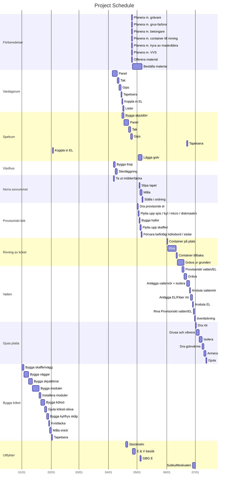

# Schema

```mermaid
    gantt
        title Project Schedule
        dateFormat YYYY-MM-DD
        axisFormat %m/%d

        section Förberedelser
        Planera m. grävare : 2024-04-25, 1d
        Planera m. grus-farbror : 2024-04-25, 1d
        Planera m. betongare : 2024-04-25, 1d
        Planera m. container till rivning : 2024-04-25, 1d
        Planera m. hyra av maskvibbra : 2024-04-25, 1d
        Planera m. VVS : 2024-04-25, 1d
        Offerera material : 2024-04-25, 1d
        Beställa material : 2024-04-26, 10d

        section EL-central

        section Vardagsrum
        Panel           : p-var,        2024-04-05,     5d
        Tak             : t-var,        after p-var,        2d
        Gips            : g-var,        after t-var,        2d
        Tapetsera       : tapet-var,    after g-var,        1d
        Koppla in EL    : el-var,       after tapet-var,    1d
        Lister          : lister-var,   after el-var,       1d


        section Spelrum
        Bygga skjutdörr : door,     2024-04-15,     2d
        Panel           : p,        after door,     5d
        Tak             : t,        after p,        2d
        Gips            : g,        after t,        2d
        Tapetsera       : tap,      after g,        1d
        Koppla in EL    : el,       after tap,      1d
        Lägga golv      : floor,    after el,       4d


        section Växthus
        Bygga ihop      : b,        2024-04-06,     2d
        Stenläggning    : sten,     after b,        2d


        section Norra sovrummet
        Ta ut möbler/täcka  :   f,      2024-04-06,     1d
        Slipa tapet         :   s,      after f,        1d
        Måla                :   m,      after s,        2d
        Ställa i ordning    :  sio,     after m,        1d


        section Provisoriskt kök
        Dra provisorisk el                          : el,   2024-05-01, 1d
        Flytta upp spis / kyl / micro / diskmaskin  : f,    after el,   1d
        Bygga hyllor                                : h,    after f,    1d
        Flytta upp skafferi                         : sk,   after h,    1d
        Förvara befintligt köksbord / stolar        : for,  after sk,   1d


        section Rivning av köket
        Container på plats  :   c-1,        2024-06-01, 1d
        Riva                :   riva,       after c-1,  9d
        Container tillbaka  :   c-0,        after riva, 1d
        Gräva ur grunden :      gr,         after c-0,  7d
        
        section Vatten
        Provisoriskt vatten/EL      : p-el,             2024-06-17,             2d
        Gräva                       : g,                after p-el,             3d
        Anlägga vattenrör + isolera : v-iso,            after g,                3d
        Ansluta vattenrör           : ans-v,            after v-iso,            1d
        Anlägga EL/Fiber rör        : anl-el,           after ans-v,            2d
        Ansluta EL                  : ans-el,           after anl-el,           1d
        Riva Provisoriskt vatten/EL : riv-el-vatten,    after ans-el,           1d
        övertäckning                : over,             after riv-el-vatten,    1d


        section Gjuta platta
        Dra rör : 2024-07-01, 1d
        Grusa och vibrera : 2024-07-02, 3d
        Isolera : 2024-07-05, 3d
        Dra golvvärme : 2024-07-08, 2d
        Armera : 2024-07-10, 2d
        Gjuta : 2024-07-12, 1d


        section Bygga köket
        Bygga skafferivägg  :   ska-wall,   2024-01-01,         2d
        Bygga väggar        :   walls,      after ska-wall,     5d
        Bygga skjutdörrar   :   sliding,    after walls,        4d
        Bygga moduler       :   modul,      after sliding,      7d
        Installera moduler  :   inst-modul, after modul,        2d
        Bygga köksö         :   island,     after inst-modul,   4d
        Gjuta köksö-skiva   :   island-p,   after island,       2d
        Bygga kyl/frys skåp :   k-f,        after island-p,     2d
        Kvistlacka          :   lacka,      after k-f,          1d 
        Måla snick          :   paint,      after lacka,        2d
        Tapetsera           :   tap,        after paint,        1d


        section Utflykter
        Stockholm : 2024-04-19, 2d
        E & V besök : 2024-04-26, 3d
        GBG E : 2024-05-04, 1d
        Subkultfestivalen : 2024-06-28, 3d


```