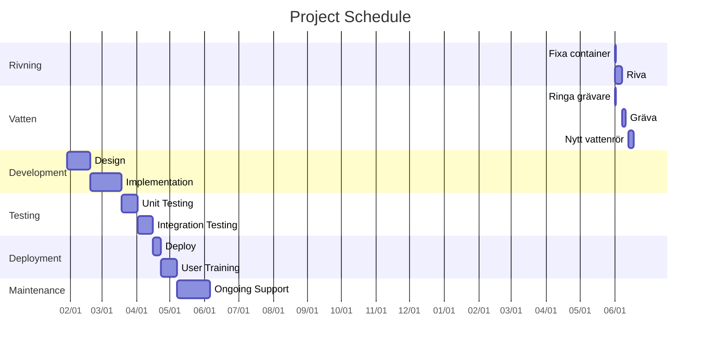

# Schema

```mermaid
    gantt
        title Project Schedule
        dateFormat YYYY-MM-DD
        axisFormat %m/%d

        section Rivning
        Fixa container : 2024-06-01, 1d
        Riva : 2024-06-1, 7d
        
        section Vatten
        Ringa grävare : 2024-06-01, 1d
        Gräva : 2024-06-08, 3d
        Nytt vattenrör : 2024-06-13, 5d

        section Development
        Design : 2023-01-29, 21d
        Implementation : 2023-02-19, 28d

        section Testing
        Unit Testing : 2023-03-19, 14d
        Integration Testing : 2023-04-02, 14d

        section Deployment
        Deploy : 2023-04-16, 7d
        User Training : 2023-04-23, 14d

        section Maintenance
        Ongoing Support : 2023-05-07, 30d
```