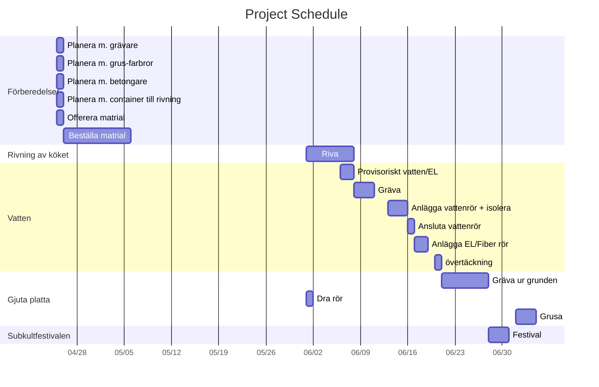

# Schema

```mermaid
    gantt
        title Project Schedule
        dateFormat YYYY-MM-DD
        axisFormat %m/%d

        section Förberedelser
        Planera m. grävare : 2024-04-25, 1d
        Planera m. grus-farbror : 2024-04-25, 1d
        Planera m. betongare : 2024-04-25, 1d
        Planera m. container till rivning : 2024-04-25, 1d
        Offerera matrial : 2024-04-25, 1d
        Beställa matrial : 2024-04-26, 10d

        section Rivning av köket
        Riva : 2024-06-01, 7d
        
        section Vatten
        Provisoriskt vatten/EL : 2024-06-06, 2d
        Gräva : 2024-06-08, 3d
        Anlägga vattenrör + isolera : 2024-06-13, 3d
        Ansluta vattenrör : 2024-06-16, 1d
        Anlägga EL/Fiber rör : 2024-06-17, 2d
        övertäckning : 2024-06-20, 1d

        section Gjuta platta
        Gräva ur grunden : 2024-06-21, 7d
        Dra rör : 2024-06-01, 1d
        Grusa : 2024-07-02, 3d

        section Subkultfestivalen
        Festival : 2024-06-28, 3d


```